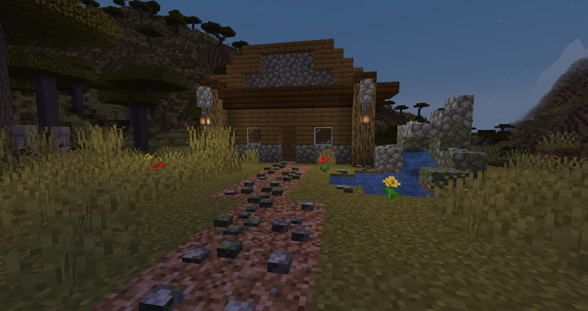
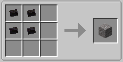
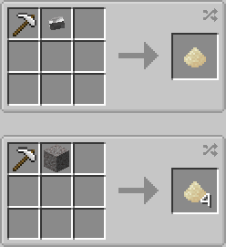
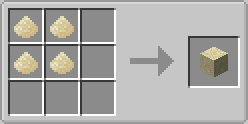
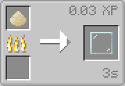
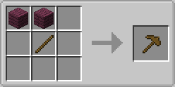
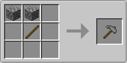
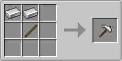
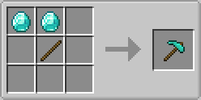

Welcome to the Pebbles repository.

Pebbles is a Minecraft mod that adds different types of pebbles to the game.
They can be placed on the ground up to groups of 4.

They can also be thrown at people or creatures you don't like (don't expect much damage though)

Pebbles come in many varieties:

- Stone
- Cobblestone
- Mossy Cobblestone
- Granite
- Sandstone
- Red Sandstone
- Diorite
- Deepslate
- Calcite
- Netherrack
- End Stone
- Blackstone

Coming Soon:

- Terracotta Variants
- Concrete Variants

## Great For Decoration
Assuming you can build better than I can...

## World Generation
Various types of pebbles can be found throughout the world

#### Above Ground

#### Underground

#### The Nether

#### The End

## Throw Pebbles
Just because you can, doesn't mean you should! Don't expect them to do much damge

## Recipes

### Pebbles
Any of the supported blocks can be turned into to pebbles using a [Rock Hammer](#Rock-Hammer). They also generate naturally in the world

### Gravel
Combining <b>any</b> 4 pebbles will create a block of Gravel

### Sand Pile
A Sand Pile can be created either by combining the Rock Hammer and a single pebble, or get 4 Sand Piles by combining a block of Gravel and the Rock Hammer

##### Sand Block
Sand Piles can be crafted into a Sand Block

##### Glass Pane
A Sand Pile can be smelted into a single glass pane 

### Rock Hammer
This item is used for crafting the pebbles, and the Sand Pile

##### Wooden Rock Hammer

##### Stone Rock Hammer

##### Iron Rock Hammer

##### Diamond Rock Hammer
